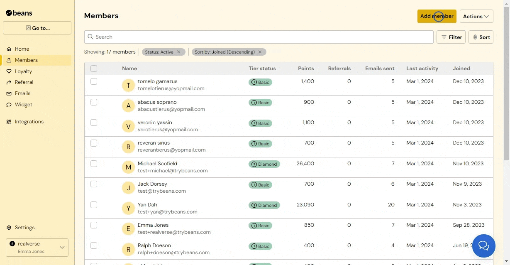
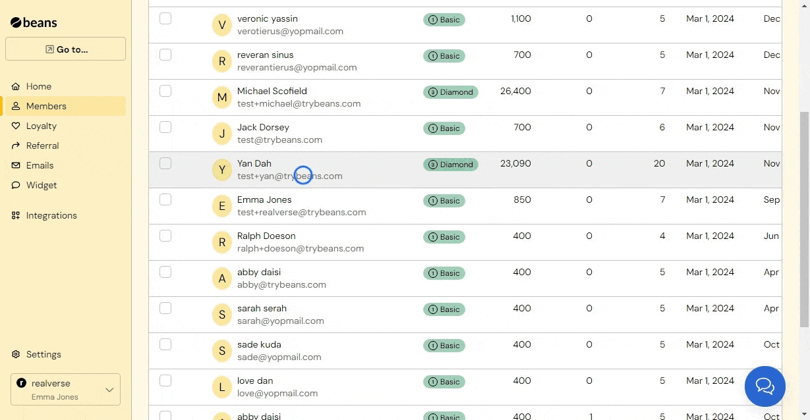
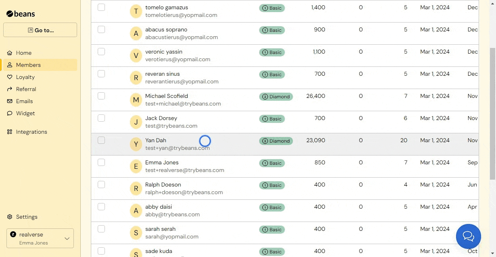
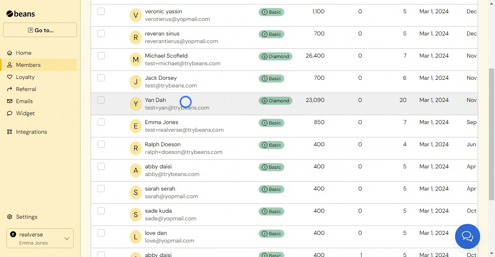
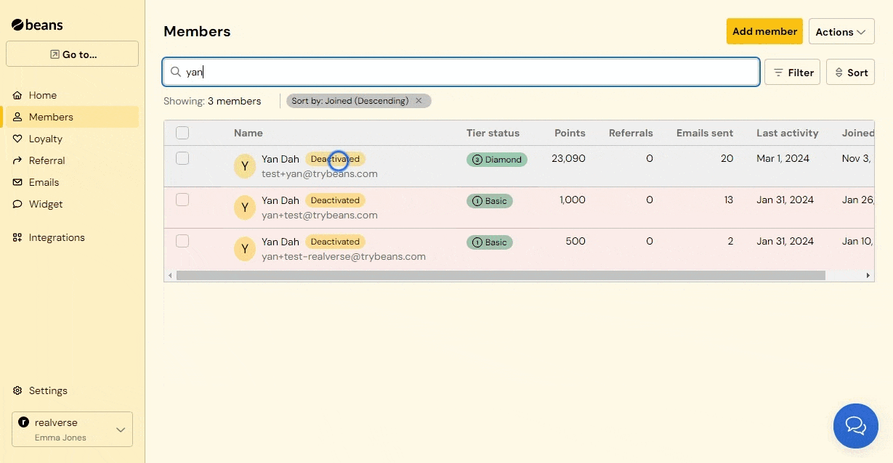
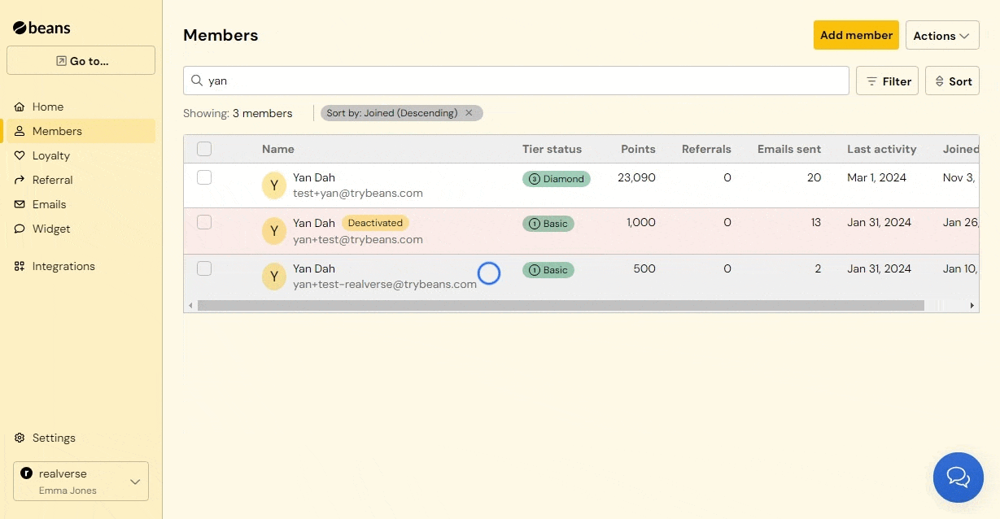
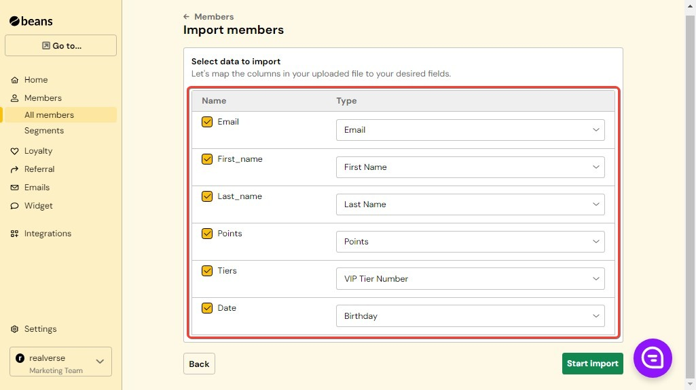
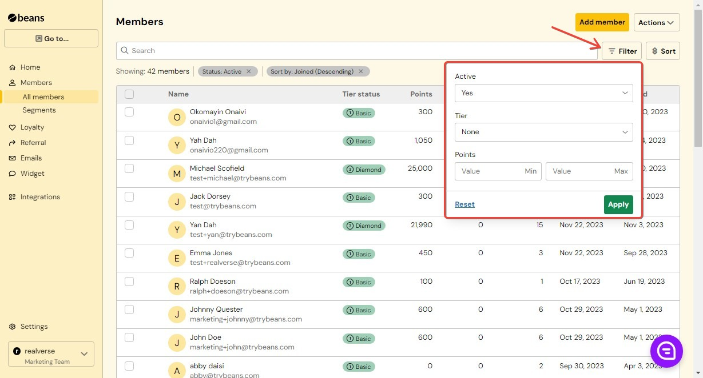
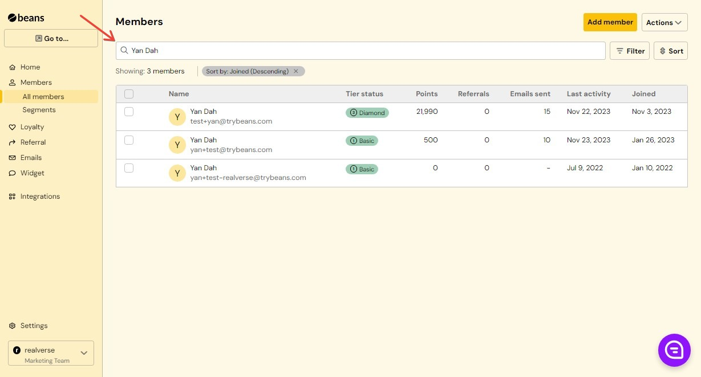
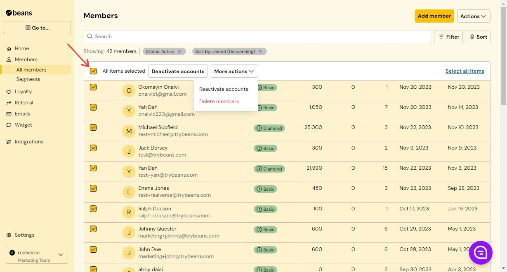

<Frame caption="Members management">
  
</Frame>
Managing memberships involves overseeing the entire journey of members within the Beans app's rewards program.

This includes :

## Add a member

You have the option to add members to your loyalty program manually, allowing them to fully experience the benefits of the rewards program and encouraging their active participation in store-related activities, thereby boosting your sales.

To manually add a member to your loyalty program, follow these steps:

1. Navigate to the Members section in your Beans dashboard.

2. Look for an "Add Member" button or option.

3. Fill out the required fields, which include the member's name, and email address.

4. Submit the form to add the member to your program.

<Frame caption="Members management - add member">
  
</Frame>

## Update profile 

You can update a member profile from the Beans dashboard.

Steps

1. From your Beans dashboard, go to **Members**

2. Click the name of the member

3. Click the **Edit** button and choose **Update Profile.**

## Update email addresses 

You have the ability to append a new email address to a member's existing email.

Steps

1. From your Beans dashboard, go to **Members**.

2. Locate the member, Click the members name

3. On the member details page, click the edit option, then click on email addresses.

<Frame caption="Members management - email-address">
  
</Frame>

- ## Deactivating an account

Deactivating a member involves revoking a customer's access to your rewards program. A customer can be deactivated either manually or automatically based on their activity.

When a customer is deactivated, they will be unable to receive emails, earn points, redeem points, refer friends, or access their earned rewards. No data is deleted, and you can reactivate the customer's account later if necessary.

<Warning>
  If a customer chooses to opt out of the program or if email notifications are returned with a bad status, such as spam
  reports, the account will be automatically deactivated. If you think that an automatic deactivation was a mistake, you
  can reactivate the account.
</Warning>
Steps

1. From your Beans dashboard, go to Members

2. Locate the member you would like to deactivate and click to open their profile details.

3. On the **Member** details page, click on the Edit button, then click on **Deactivate account**.

4. Confirm the deactivation when prompted.

<Frame caption="Members management - deactivating-account">
  
</Frame>

## Activating member

If a customer chooses to opt out of the program or if email notifications are returned with a bad status, such as spam reports, the account will be automatically deactivated. If you think that an automatic deactivation was a mistake, you can reactivate the account.

Activating Deactivated Members to Restore Access to Your Reward Program

Steps

1. From your Beans dashboard, go to Members page

2. Locate the member you want to reactivate and click on them to open their profile details.

3. On the Member details page, click on the Reactivate button.

<Frame caption="Members management - activating-account">
  
</Frame>

## Delete a member

You have the option to remove individual member profiles.

<Warning>
  Deleting a member will permanently remove them from Beans and erase all associated data. This action can't be undone.
</Warning>

Steps

1. From your Beans dashboard, go to **Members**

2. Locate the member you would like to delete and click to open their profile details.

3. On the **Member details** page, click on the **Edit** button, then click on **Delete account**.

<Frame caption="Members management - Delete-member">
  
</Frame>

## List

The list displays all members associated with your Beans app. You can view basic information about each member, such as their name, email address, and tier status.

<Frame caption="Members management - list">
  
</Frame>

## Filter

You can filter your Member page to show specific information based on criteria such as membership status, or points balance. To apply a filter, click on the "Filter" option and select the criteria you want to filter by. You can also reset the filter to view the full list of members.

<Frame caption="Members management - filters">
  
</Frame>

## Search members

The search function allows you to find a member by entering their name, email address, or any other relevant information. The search function searches across all fields, making it easy to locate a specific member.

<Frame caption="Members management - search-members">
  
</Frame>

## Perform bulk actions

**Selecting Multiple Members**: To select multiple members for bulk actions, you can use checkboxes next to each member's name. Simply click on the checkboxes next to the members you want to include in the bulk action.

**After Performing a Bulk Action**: After selecting the members and choosing the bulk action (e.g., deactivate accounts, reactivate accounts, delete members), you may be prompted to confirm the action. This confirmation step helps prevent accidental actions. Once confirmed, the bulk action will be applied to all selected members. Depending on the action, you may receive feedback indicating the action was successful or any errors encountered during the process.

<Frame caption="Members management - bulk-action">
  
</Frame>
